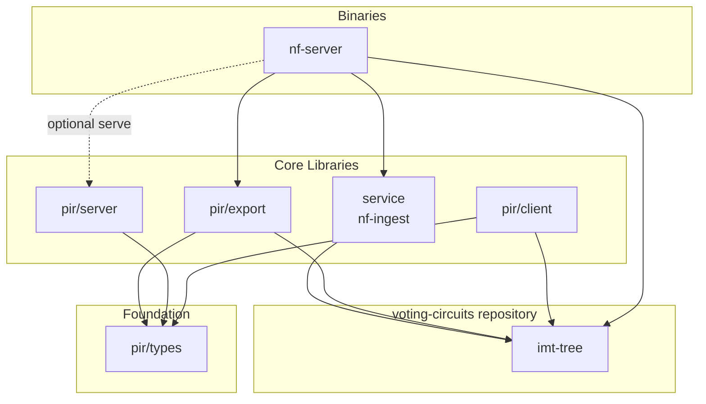

# Vote Nullifier PIR

Private Information Retrieval (PIR) system for Ironwood nullifier non-membership proofs. Allows a client to prove that a nullifier does **not** exist in the on-chain Ironwood nullifier set without revealing *which* nullifier it is querying — a key building block for shielded voting.

- [ZIP Specification (PR)](https://github.com/zcash/zips/pull/1198)
- [PIR Tree Specification](docs/pir-tree-spec.md)
- [PIR Parameter Selection](docs/params.md)

## Architecture

The system is organised as a Cargo workspace with seven crates split across three layers.
`imt-tree` lives in the [voting-circuits](https://github.com/valargroup/voting-circuits)
repository, next to `voting-crypto-deps`, and is used as a published dependency:



### Crate Descriptions

| Crate | Path | Description |
|-------|------|-------------|
| **imt-tree** | [voting-circuits](https://github.com/valargroup/voting-circuits) `imt-tree/` | Indexed Merkle Tree library (external dependency). Poseidon hashing, punctured-range exclusion proofs (K=2), and tree-building primitives for circuit compatibility. |
| **pir-types** | `pir/types/` | Lightweight shared types (`YpirScenario`, `RootInfo`, `HealthInfo`) serialised over HTTP between server and client. Also contains YPIR wire-format helpers. |
| **pir-export** | `pir/export/` | Builds the depth-19 PIR tree from punctured-range leaves (K=2), persists `nullifiers.tree` checkpoints, and exports the plaintext `tier0.bin` plus PIR-backed `tier1.bin`. |
| **pir-server** | `pir/server/` | YPIR server-side logic: loads tier data, processes encrypted PIR queries, and returns encrypted responses. |
| **pir-client** | `pir/client/` | YPIR client-side logic: generates encrypted queries, decodes responses, and assembles circuit-ready `ImtProofData`. Provides an async `PirClient` API and a local in-process mode. |
| **nf-ingest** | `nf-ingest/` | Shared library for nullifier sync from lightwalletd, flat-file storage (`nullifiers.bin`), and configuration. |
| **nf-server** | `nf-server/` | Unified CLI: `dataset-info`, `sync` (lightwalletd → `nullifiers.tree` → tier files), `verify-root` (raw blocks → authenticated root comparison), and `serve` (PIR HTTP server, feature-gated). |
| **pir-test** | `pir/test/` | End-to-end test harness with `small`, `local`, `server`, and `bench` modes. |

## Pipeline

The system operates as a resumable pipeline:

```
nf-server sync (nullifiers → nullifiers.tree → tier files) ──> serve ──> client query
```

1. **`nf-server sync`** — Streams Ironwood nullifiers into `nullifiers.bin` (with dataset marker, checkpoint, and index), builds a versioned **`nullifiers.tree`** checkpoint, then writes `tier0.bin`, `tier1.bin`, and `pir_root.json` under `--pir-data-dir`. The dataset marker and root metadata identify the Zcash network. Reruns skip completed stages.
2. **`nf-server serve`** — Starts an HTTP server that serves tier data and answers YPIR queries. The client downloads tier 0 in plaintext, then privately retrieves one tier 1 row with a single encrypted PIR query.

`nf-server verify-root` independently rebuilds an Ironwood circuit root from raw
blocks anchored to a caller-authenticated snapshot block hash. It is available in
every build and is separate from the pipeline above: verification adds no calls,
fields, or payload to standard lightwalletd sync and writes no sync artifacts.

For an on-chain voting round, use [the round verification script and AI
guide](docs/verify-round-imt-ai.md). It selects the latest registered round or an
explicit ID, checks the round identity, and repeats the normal PIR sync and tree
construction in a fresh directory. It requires the exact snapshot height and
compares the resulting circuit root with the on-chain root. Supply a trusted
`--lwd-url`; no report upload is needed. Use `--mode raw-blocks` for the optional
authenticated raw-block rebuild.

See [root verification](docs/verify-root.md) for the trust contract, CLI examples,
failure behavior, and recorded mainnet validation.

## Build & Run

Requires Rust 1.91 or newer (nightly for `pir-server` with AVX-512 support).

Crates that use the voting crypto types expose two mutually exclusive backend
features. `zakura` is enabled by default. Upstream consumers must disable
default features and enable `upstream`; selecting both backends or neither
backend fails to compile.

```bash
# Build everything
cargo build --release

# Build the full workspace with the upstream backend
cargo +1.91.0 build --workspace --release --no-default-features \
  --features pir-types/upstream,pir-client/upstream,pir-export/upstream,pir-export/cli,pir-server/upstream,nf-ingest/upstream,nf-server/upstream,nf-server/serve,pir-test/upstream

# Or use the Makefile for the standard pipeline:
make build          # Build nf-server binary
SVOTE_ZCASH_NETWORK=test LWD_URLS="$TESTNET_LWD_URLS" PIR_DATA_DIR=pir-data/test make sync
SVOTE_ZCASH_NETWORK=test PIR_DATA_DIR=pir-data/test make serve
nf-server dataset-info  # Print the supported pool and dataset version

# Run tests
make test           # Unit tests for nf-ingest
cargo test -p pir-export  # PIR export round-trip tests
```

### Configuration

Override via environment variables or Make arguments:

| Variable | Default | Description |
|----------|---------|-------------|
| `SVOTE_ZCASH_NETWORK` | required | Zcash network: `main` or `test` |
| `PIR_DATA_DIR` | `pir-data` | On-disk root: `nullifiers.bin`, dataset marker, checkpoint, index, `nullifiers.tree`, and tier files (`SVOTE_PIR_DATA_DIR` for `nf-server`) |
| `LWD_URL` | `https://us.zec.stardust.rest:443` | Lightwalletd gRPC endpoint |
| `LWD_URLS` | unset | Comma-separated lightwalletd endpoints for `SVOTE_ZCASH_NETWORK`. Overrides `LWD_URL` when set. |
| `PORT` | `3000` | HTTP server port |
| `SYNC_HEIGHT` | chain tip | Sync up to this block height (must be a multiple of 10) |
| `SVOTE_PIR_SYNC_RESET` | unset | Set to `1` to wipe the dataset, tree, and tiers before `sync` |
| `SVOTE_PIR_VOTING_CONFIG_URL` | (see `nf-server sync --help`) | Empty string skips voting-config fetch during `sync` |

## Deployment

See [docs/runbooks/server-setup.md](docs/runbooks/server-setup.md) for production deployment instructions, hardware sizing, install, and systemd configuration. For the CI/CD pipeline and GitHub Actions workflow details, see [docs/runbooks/ci-setup.md](docs/runbooks/ci-setup.md).

## Storage Format

All data is stored as flat binary files under one network-specific directory (overridable via `PIR_DATA_DIR` / `SVOTE_PIR_DATA_DIR`):

- `nullifiers.bin` — Append-only raw 32-byte Ironwood nullifier blobs
- `nullifiers.dataset.json` — Dataset identity (`zcash_network`, `nullifier_pool: "ironwood"`, `dataset_version: 2`)
- `nullifiers.checkpoint` — 16-byte crash-recovery marker (height + byte offset, both LE u64)
- `nullifiers.index` — Height-to-offset index for subset loading
- `nullifiers.tree` — Versioned PIR Merkle checkpoint (see `pir-export`)
- `tier0.bin`, `tier1.bin`, `pir_root.json` — PIR tier payload and root metadata, including the dataset identity

Unlabeled and Orchard artifacts are not reusable. Keep mainnet and testnet data in separate directories and rebuild each dataset with `SVOTE_PIR_SYNC_RESET=1`.

## PIR Write Ups

- [YPIR Security](https://x.com/akhtariev/status/2030768109196316712)
- [PIR Applications in Zcash](https://www.akhtariev.ca/blog/sync-tax)
- [Motivation for Compression/Packing](https://x.com/akhtariev/status/2030449201335705640)
- [GPU Optimizations](https://www.akhtariev.ca/blog/pir-gpu-acceleration)
